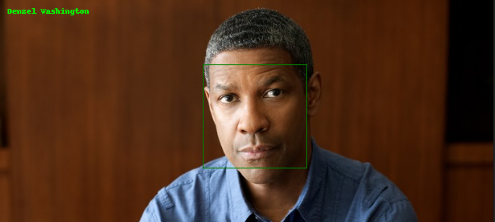
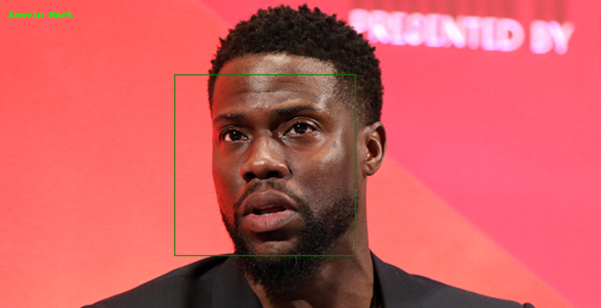
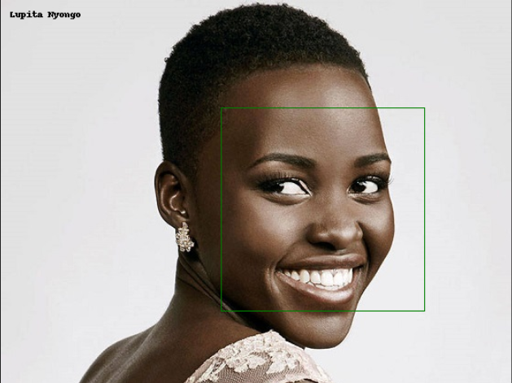

# Pre-trained facenet model
You can download the pre-trained tensorflow facenet model trained using the [VGGFace2 dataset](https://www.robots.ox.ac.uk/~vgg/data/vgg_face2/) from [here](https://drive.google.com/file/d/1EXPBSXwTaqrSC0OhUdXNmKSh9qJUQ55-/view) and add it @/models/tf


# Face Recognition with deep learning
### Description
This document describes the face recognition model for the ARMS
project's resource management and cataloging system facial authentication
service.
### Project setup
>##### Install python 3.6 for dlib support

> ##### Install requirements 
> ```python 
> pip install -r requirements.txt
>```

### Steps involved
1. Load image and locate the face from the image
2. Identify facial features of the extracted face.
3. Align face to match the ideal pose
4. Obtain face encodings using a pre-trained neural network
5. Determine the Euclidean distance between the face encodings of
known and unknown face to determine if it is the same person.
### Tools used
1.  **Dlib** a general purpose library containing machine learning algorithims
and tools for creating complex systems.
2. [**face_recognition**](https://github.com/ageitgey/face_recognition) a python
library built on top of dlib's state-of-the-art face recognition built with deep learning. The model has an accuracy of 99.38% on the Labeled [Faces in the Wild](http://vis-www.cs.umass.edu/lfw/) bench mark

#### Implementation.
Facedetection. \
face detection is done using the face_recognition library.
The detection is based on method called [Histogram of Oriented Gradients](https://www.learnopencv.com/histogram-of-oriented-gradients/)
**(HOG)**. \
The face_recognition library provides us with a method that does this (face-locations), this returns pixels that represent the face location boundary. 
```python
image = face_recognition.load_image_file('rodrick.jpg')

face_location = face_recognition.face_locations(image)[0]

p_image = PIL.Image.fromarray(image)
top, right, bottom, left = face_location
draw = PIL.ImageDraw.Draw(p_image)
draw.rectangle([left, top, right, bottom], outline="green", width=2)

p_image.show()
```


### Face Recognition
The face recognition phase included the last steps involved. 
The [face_recognition](https://github.com/ageitgey/face_recognition) library provides us with a function that carries out
all these steps and these include:
- **Identify the facial features of the located face**, the 
face_recognition library uses the [face landmark detection](https://www.pyimagesearch.com/2018/04/02/faster-facial-landmark-detector-with-dlib/) algorithim to
determine the facial features.
-  **Determining the face encodings** the library uses a pre-trained
neural network from dlib to obtain 128 measurements for face encodings.
- **Comparing face encodings** the library uses the SVMclassifier machine learning classification algorithim to determine
the euclidean distance between the image face encodings.

for more information about how the library is implemented, checkout [this](https://medium.com/@ageitgey/machine-learning-is-fun-part-4-modern-face-recognition-with-deep-learning-c3cffc121d78) 
link

### Below are some of the recognitions done using the face_recognition library


