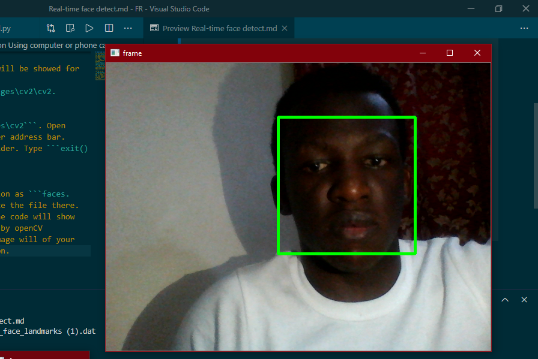

# Real-time Face Detection Using computer or phone camera
>1. Activate the virtual environment. Install OpenCV for python:
>"```pip install opencv-python```"
>2. Run your python console by typing ```python``` in terminal or command prompt.
>3. Type ```import cv2```.
> *   Type ```print(cv2.__file__)```.
>>* The openCV installation folder directory will be showed for example
>>```C:\Users\x\dev\opencvtrial\lib\site-packages\cv2\cv2.cp38-win_amd64.pyd```
>>* copy it up to ```C:\Users\x\dev\opencvtrial\lib\site-packages\cv2```. Open your file explorer and paste it in the explorer address bar. This will take you to the openCV installed folder. Type ```exit()```.
>4. Go to the ```data``` folder, copy ```haarcascade_frontalface_alt2.xml```
>5. In your project folder, in the same location as ```faces.py```. Create a folder named cascades and paste the file there.
>6. Your computer camera will be opened and the code will show as green square once a human face is detected by openCV

>7. Press "```q```" to close the camera. An image will of your face will be taken and saved for authentication.